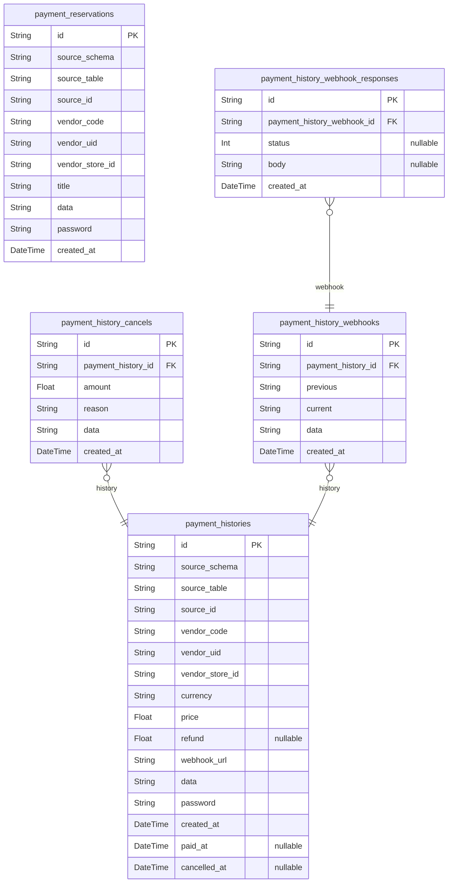

# Payments System
> Generated by [`prisma-markdown`](https://github.com/samchon/prisma-markdown)

- [Payments](#payments)

## Payments

### `payment_reservations`
간편 결제 수단 정보.

`payment_reservations` 는 고객이 신용카드 등을 정기 결제 수단으로 등록, 
매 결제시마다 반복된 결제 수단 인증 작업을 안 해도 되게끔 하는, 
이른바 "간편 결제" 에 대한 레코드 정보를 담은 테이블이다.

참고로 간편 결제에 대한 레코드를 저장할 때, 서비스 시스템은 해당 레코드에 대하여 
비밀번호를 지정하여야 한다. 비밀번호를 유실한 경우, 해당 레코드는 그 누구도 조회할 
수 없으니 서비스 시스템은 이를 잘 관리하여야 한다. 참고로 이 비밀번호는 유저의 
비밀번호와 일절 무관하여야 하며, 오직 서비스 시스템이 스스로 임의 발급한 
비밀번호여야만 한다.

이외에 PG사의 간편 결제 정보는 [payment_reservations.data](#payment_reservations) 에 저장된다.

**Properties**
  - `id`: 
  - `source_schema`: 결제를 발생시킨 원천 레코드의 스키마
  - `source_table`: 결제를 발생시킨 원천 레코드의 테이블
  - `source_id`: 결제를 발생시킨 원천 레코드의 ID
  - `vendor_code`
    > PG 벤더사의 코드.
    > 
    > ex) "iamport"
  - `vendor_uid`: PG 벤더사에서 발급해준 간편 결제 식별자 키
  - `vendor_store_id`
    > PG 벤더사에서의 가맹점 ID.
    > 
    > PG 벤더사 내에서의 회원사 ID 와 진배 없다.
  - `title`: 제목.
  - `data`: PG 벤더사로부터의 간편 결제에 대한 상세 데이터.
  - `password`
    > 레코드 비밀번호.
    > 
    > 서비스 시스템이 임의로 발급한 비밀번호로써, 유저와는 하등 무관해야 함.
  - `created_at`: 레코드 생성 일시.

### `payment_histories`
결제 (신청/지불) 정보.

`payment_histories` 는 PG 시스템을 통한 결제 신청 혹은 지불 정보를 기록한 엔티티이다. 
서비스 시스템으로부 결제 사건의 귀속 정보 (vendor_X` + `source_Y`) 를 전달받아, 
본 Payment 시스템이 PG 사에 추가 정보를 취득하여 레코드가 완성된다.

그리고 만일 현 결제 건이 가상계좌와 같이 레코드 생성 시점에 지불이 이루어지지 않은 
경우라면, 사후 [웹훅 이벤트](#payment_history_webhooks)를 통하여 지불 완료 
시각을 뜻하는 [payment_histories.paid_at](#payment_histories) 이 설정될 수 있다. 반대로 이미 
결제가 완료된 경우라도, 환불 등의 이유로 [payment_histories.cancelled_at](#payment_histories) 이 
사후 기재될 수 있다.

**Properties**
  - `id`: 
  - `source_schema`: 결제를 발생시킨 원천 레코드의 스키마
  - `source_table`: 결제를 발생시킨 원천 레코드의 테이블
  - `source_id`: 결제를 발생시킨 원천 레코드의 ID
  - `vendor_code`
    > PG 벤더사의 코드.
    > 
    > ex) "iamport"
  - `vendor_uid`: PG 벤더사에서 발급해준 간편 결제 식별자 키
  - `vendor_store_id`
    > PG 벤더사에서의 가맹점 ID.
    > 
    > PG 벤더사 내에서의 회원사 ID 와 진배 없다.
  - `currency`
    > 기준 통화.
    > 
    > KRW, USB, JPY 등.
  - `price`: 결제 가격.
  - `refund`: 결제 취소 시의 환불 금액.
  - `webhook_url`
    > 웹훅 URL. 
    > 
    > 웹훅 데이터를 받아갈 서비스 시스템의 URL.
  - `data`
    > PG 벤더사로부터의 결제 이력에 대한 상세 데이터.
    > 
    > JSON-string 이 암호화되어 저장되어있다.
  - `password`
    > 레코드 비밀번호.
    > 
    > 서비스 시스템이 임의로 발급한 비밀번호로써, 유저와는 하등 무관해야 함.
  - `created_at`: 레코드 생성 일시
  - `paid_at`
    > 결제 완료 일시.
    > 
    > 가상 계좌와 같이, 레코드 생성 일시와 결제 완료 일시가 다를 수 있다.
  - `cancelled_at`
    > 결제 취소 시간.
    > 
    > 단, 결제 취소가 여러번에 걸쳐 일어난 경우 (부분 환불), 
    > 가장 첫 번째의 취소 시간을 기록한다.

### `payment_history_cancels`
결제 취소 이력.

결제 취소 이력을 기록한 엔티티.

단, 본 시스템을 통하지 않고 각각의 PG사로 직접 접속하여 결제 취소한 경우,
그 내역이 정확하지 않을 수 있다. 다만 PG사로부터 웹훅 이벤트 발생시, 매번 데이터를
갱신하고 있기에, 그 부정확함이 영구적이지는 않다.

**Properties**
  - `id`: 
  - `payment_history_id`: 귀속 결제 이력의 [payment_histories.id](#payment_histories)
  - `amount`: 환불 금액.
  - `reason`: 취소 사유.
  - `data`
    > PG 벤더사로부터의 결제 취소 이력에 대한 상세 데이터.
    > 
    > JSON-string 이 암호화되어 저장되어있다.
  - `created_at`: 결제 취소 시간.

### `payment_history_webhooks`
웹훅 이벤트 레코드.

`payment_history_webhooks` 는 PG 벤더사로부터의 이벤트를 기록하는 엔티티이다. 

웹훅 이벤트는 고객이 가상계좌를 선택하고 사후에 지불을 완료했다던가, 이미 결제한 
금액을 환불하여 결제가 취소되었다던가 하는 등의 이유로 발생한다. 그리고 웹훅 이벤트 
레코드의 발생은 곧, 원천 결제 레코드에 해당하는 [payment_histories.data](#payment_histories) 의 
수정을 불러온다.

때문에 [payment_history_webhooks.previous](#payment_history_webhooks) 라 하여, 웹훅 이벤트가 발생하기 
전의 [payment_histories.data](#payment_histories) 를 기록하는 속성이 존재한다. 만일 웹훅 
이벤트가 발생하여 변동된 데이터를 보고 싶다면, 현 웹훅 이벤트가 가장 최신인지 
여부를 따져, [payment_histories.data](#payment_histories) 를 조회하던가 아니면 그 다음 웹훅 
레코드의 [payment_history_webhooks.previous](#payment_history_webhooks) 를 조회하던가 하면 된다.

**Properties**
  - `id`: 
  - `payment_history_id`: 귀속 결제 이력의 [payment_histories.id](#payment_histories)
  - `previous`: 이전 결제 이력의 [payment_histories.data](#payment_histories)
  - `current`: 웹훅 이후의 결제 이력에 대한 [payment_histories.data](#payment_histories)
  - `data`
    > PG 벤더사로부터 받은 웹훅 데이터.
    > 
    > [payment_histories.data](#payment_histories) 와는 다르다
  - `created_at`: 웹훅 레코드 생성 일시.

### `payment_history_webhook_responses`
서비스 시스템의 웹훅에 대한 응답 이력 레코드.

`payment_history_webhook_responses` 는 서비스 시스템이 본 Payment 시스템으로부터 
전송받은 웹훅 이벤트에 대한 응답을 기록하는 엔티티이다. 만일 서비스 시스템이 
먹통이라 데이터 수신 자체를 못하는 상황이라면, `status` 와 `body` 데이터 모두 
`NULL` 값이 부여된다.

그리고 본 Payment 시스템이 서비스 시스템으로 전송하는 웹훅 이벤트 데이터 또한, 
본 시스템의 여타 API 와 같이 `body` 부문이 암호화 처리되어 전송된다. 자세한 내용은 
본 저장소의 README 문서를 참고할 것.

**Properties**
  - `id`: 
  - `payment_history_webhook_id`: 귀속 웹훅의 [payment_history_webhooks.id](#payment_history_webhooks)
  - `status`: HTTP 응답 상태 코드.
  - `body`: HTTP 응답 본문.
  - `created_at`: 레코드 생성 일시.